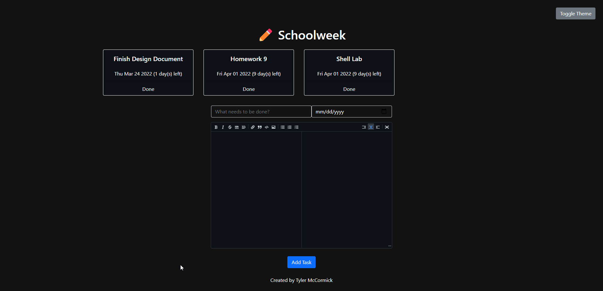
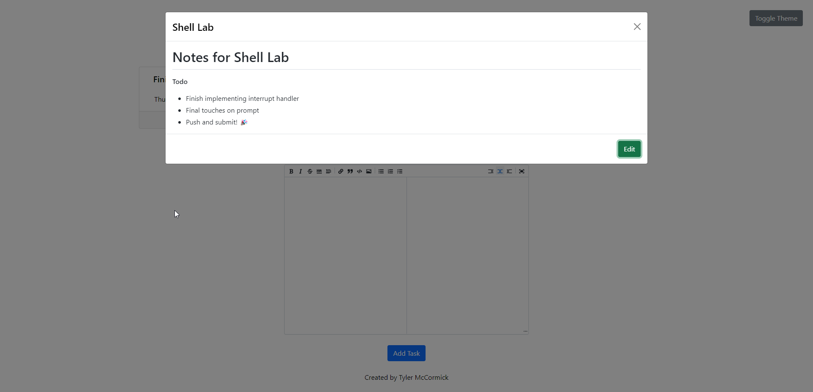
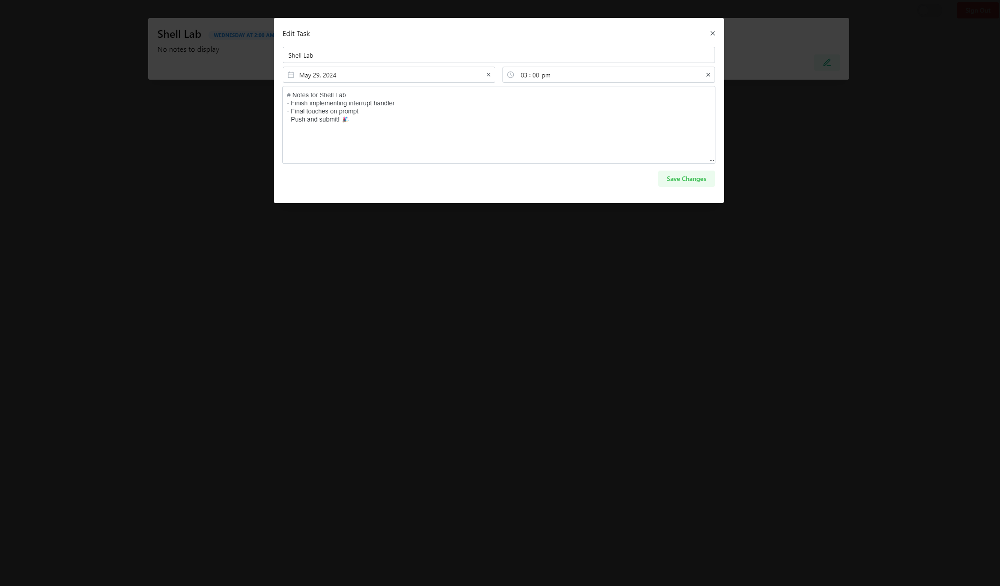

# Schoolweek

A lightweight task and assignment organization web application built with React

[Visit Schoolweek](http:/typicel.me/schoolweek)

---

**Features**

- Keep track of all of your tasks for school
- Clear tasks that are finished
- Tasks are sorted by due date, so more pressing tasks will appear first in the list
- Edit tasks, so you can come back to them later or change a due date
- Dark theme! (WIP, not fully finished)
- Tasks are stored in your browser, so you don't need to worry about them going away when you reload

---

[Markdown Editor from uiwjs](https://github.com/uiwjs/react-md-editor)
